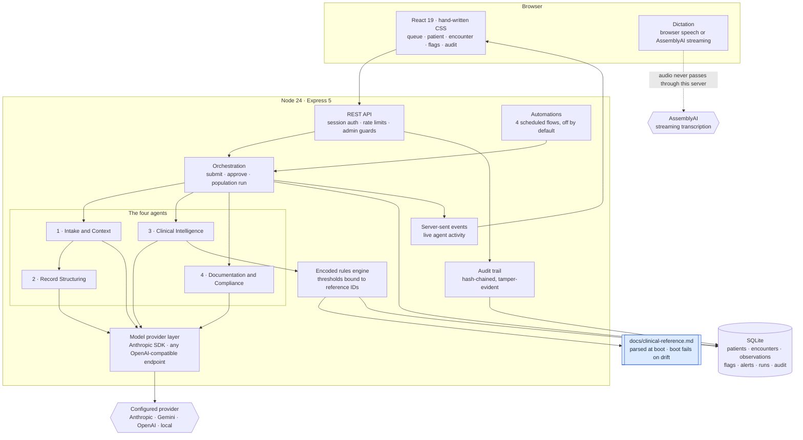
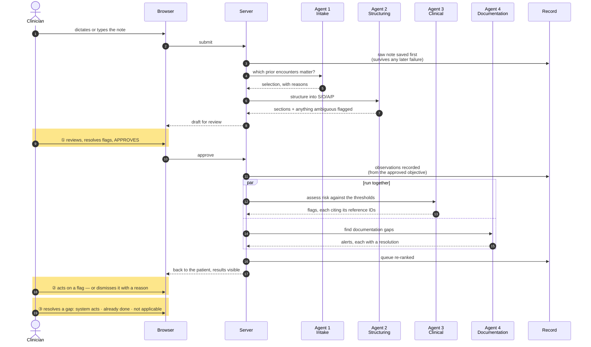
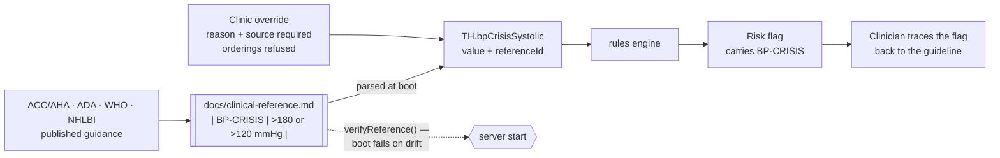

# Architecture

Three diagrams. The first is the shape of the system, the second is what happens
during an encounter, and the third is the idea the whole thing rests on: clinical
logic is data, not code.

---

## 1. The system

**Rules decide what is clinically significant; agents decide how to say it.** The
thresholds are encoded and testable. The model's job is judgement and language,
not arithmetic — which is why a wrong model answer degrades the wording rather
than the safety.

**No local engine stands behind the model.** If the provider is unreachable, out
of credit, or rejecting the key, the work stops and says so. Answering anyway
from encoded rules would put clinical text on screen attributed to an agent that
never ran, and a clinician has no way to audit reasoning that did not happen.

---

## 2. An encounter, end to end

The three amber gates are decisions that belong to the clinician. They are
enforced on the server, not just hidden in the interface.

Agents 3 and 4 genuinely run in parallel. Millisecond timestamps cannot prove
that, so each run records how many agents were already in flight when it began
(`concurrency_at_start`), and the run log shows it.

---

## 3. Clinical logic is data

Every threshold lives in a markdown file with the published guidance it came
from. The file is parsed at startup; each number in the code binds to an entry
ID; boot fails if the two ever disagree.

This is what makes "your own version" real rather than aspirational: a clinic in
another region forks the reference file — different guidelines, different disease
mix, same engine.

---

## Stack

TypeScript, Node 24, Express 5, SQLite (`better-sqlite3`), React 19, Vite,
Vitest. No ORM, no component library, no state manager — see
[`STACK.md`](STACK.md) for why each was chosen.

The scenario suite runs the agents against encoded stand-ins, so 146 clinical
tests need no API key, no network and no bill. That path is reachable only via
`MODEL_TEST_DOUBLE`, which `npm test` sets and the server refuses to start with
in production.
